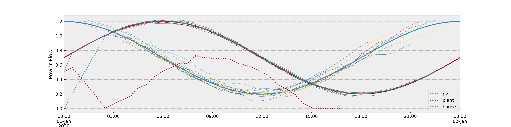

.. district_control documentation master file, created by
   sphinx-quickstart on Sat Dec 18 20:27:07 2021.
   You can adapt this file completely to your liking, but it should at least
   contain the root `toctree` directive.

Welcome to an overview of the basics of district_control (working title)
=====================================
This repository provides an easy and slim toolkit to use the power of PyPSA  
in the context of **Model predictive control**.

.. toctree::
   :maxdepth: 2
   :caption: Contents:

Contents
########

   * Installation 
   * Basic Example
   * How it works

Installation
############

Next to a linear solver, the repo has minimal requirements. To get ready, run

.. code-block:: console

   $ conda env create -f environment.yaml

Basic Example
#############

This is a boiled down version of `this example notebook <https://github.com/LukasFrankenQ/district_control/blob/master/examples/basic_example.ipynb>`_,
only looking at the lines that illustrate what this repository attempts to do.

We first set up a basic network, consisting of a single load called `'house'`, renewable generation `'pv'` and 
dispatchable generation `'plant'`.

.. code-block:: python

   def make_small_network():
       ...

Next, we set up the overall timeframe of control and define the horizon

.. code-block:: python

   t_steps = 48
   total_snapshots = pd.date_range('2020-01-01', '2020-02-01', freq='30min')[:t_steps]
   horizon = 13

We now define which quantities are subject to prediction. For `'pv'` we predict `p_max_pu` and
for the `'house'` we predict `p_set`. Another quantity we want to fix (not predict) is the plant's
`marginal_cost`. Note that this example uses `Prophet`-objects in `'read'` mode. Hence, they
do not use machine learning models and instead read off data and add noise artificially. Including
actual ML models is a work in progress.

.. code-block:: python

   prophets_config = {
         'pv': [
                  {
                  'kind': 'p_max_pu', 
                  'mode': 'read', 
                  'noise_scale': 0.02,
                  'data': os.path.join(data_path, 'supply.csv')
                  },
                  ],
         'house': [
                  {
                  'kind': 'p_set', 
                  'mode': 'read',
                  'noise_scale': 0.005, 
                  'data': os.path.join(data_path, 'demand.csv')
                  },
                  ],
         'plant': [
                  {
                  'kind': 'marginal_cost',
                  'mode': 'fix',
                  'value': 1. 
                  }
                  ]
         }

We also set initial values

.. code-block:: python

   init_values = {'pv': 0., 'plant': 0.5, 'house': 0.5}

Finally, we set up the controller object.

.. code-block:: python

   mpc = Controller(
         make_small_network(),
         total_snapshots,
         prophets_config,
         horizon,
         init_values=init_values,
         solver_name='gurobi' # or any solver installed on your machine
         )

To run the model predictive control, call the `mpc.mpc_step(...)` function:

.. code-block:: python

   for time in range(t_steps - horizon - 1):
      
      snapshots = total_snapshots[time:time+horizon+1]
      mpc.mpc_step(make_small_network,
                  snapshots)

After this, the `mpc` object stores the overall control chosen and the related cost.
We recommend to pass as `axis`-object as a keyword argument to the `mpc.mpc_step(ax=ax)` to
obtain an illustration of the results (see the notebook of this example). This is the result:

How it works
############

(work in progress)
